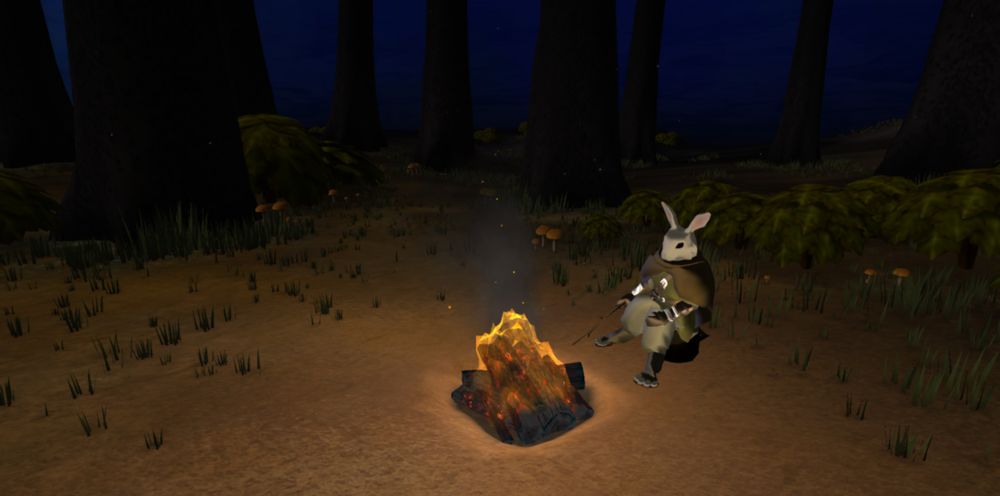
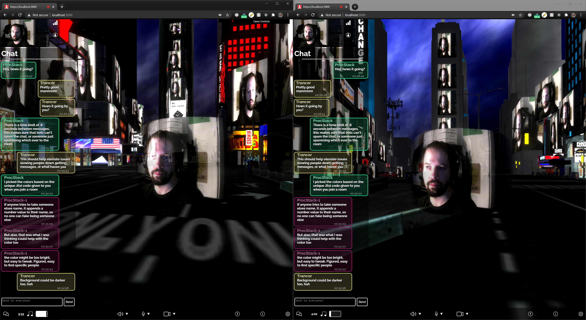

# procstack.github.io / pxlNav
### Javascript player controller & framework for three.js

#### Metown USA, baby!

Kevin Edzenga's web dev & shader resume site
 &nbsp;&nbsp;Made as a way to show off `pxlNav`
### 

[procstack.github.io](https://procstack.github.io/)

### The Good Bits -
*Wanna see the template or example rooms using 3d fbx files?*
 &nbsp; `./Source/pxlRooms`

 &nbsp;&nbsp;For `pxlNav` Documentation -
 &nbsp;&nbsp;&nbsp;&nbsp;[pxlNav Documentation](https://github.com/ProcStack/pxlNav/tree/main/docs)

 &nbsp;&nbsp;For `pxlNav` Repo with Source & Info -
 &nbsp;&nbsp;&nbsp;&nbsp;[pxlNav Repo ](https://github.com/ProcStack/pxlNav)

 &nbsp;&nbsp;Minified pxlNav, style, & assets *(if desired)* -
 &nbsp;&nbsp;&nbsp;&nbsp;`./Build`

 &nbsp;&nbsp;`pxlNav` dev entry point is -
 &nbsp;&nbsp;&nbsp;&nbsp;`./Source/js/pxlNav.js`

 &nbsp;&nbsp;`procstack.github.io` public site -
 &nbsp;&nbsp;&nbsp;&nbsp;`./docs`

##

#### Note about `pxlNav` - &nbsp;&nbsp;&nbsp;&nbsp;*November 16th, 2023*

I decided to release the `pxlNav` framework for `three.js` I wrote for use in the virtual event website `Antib0dy.club`,
 &nbsp;&nbsp;A site used during the height of the pandemic to throw multiplayer avitar filled virtual parties & dj album drops.
 &nbsp;&nbsp;&nbsp;&nbsp;With live video feeds of our house dj and event dj, switched dynamically durring events.

(Antib0dy.Club, networking has been removed though)

For `pxlNav` I wrote a first person navigation system, collision detection, camera animation sequencer,
 &nbsp;&nbsp;An in-browser opengl vert/frag shader code text editor & compiler/refresher with keyboard shortcut regex commands,
 &nbsp;&nbsp;FBX 3d scene structure to allow for Maya/Blender directly into pxlNav with complete scene comprehension.

All as a framework using `three.js` with differed render passes to allow for in-environment items
 &nbsp;&nbsp;Which could alter the screens appearance through post processing,
 &nbsp;&nbsp;&nbsp;&nbsp;Or added screen effects when using teleportation pads
 &nbsp;&nbsp;&nbsp;&nbsp;&nbsp;&nbsp;Between like-named collider+object pairs in the FBX scene file

But I did remove the `Jitsi` integration of users webcams and mics
 &nbsp;&nbsp;Implemented as their video visual avitar & audio with distance fall off attenuation.
 This is too much of a separate intergration to include in this repo, nor the `pxlNav` repo (when its created)
 It will need to have a docker script, websocket settings,
 &nbsp;&nbsp;Port forwarding, sip controlling, handshake handling,
 &nbsp;&nbsp;&nbsp;&nbsp;Room management overhaul, more asset & user managament checks, added security;
 &nbsp;&nbsp;&nbsp;&nbsp;&nbsp;&nbsp;An entire environment to set up
 &nbsp;&nbsp;So I'll likely make a pxlVideoAvitar repo in the future,
 &nbsp;&nbsp;&nbsp;&nbsp;But there are no plans for that at the moment.

Realistically, I should add Universal Scene Description (USD) support for future advancements to the system.

But heck with it, for now I'm making a rabbit druid dude poke a fire and look at a stick for my website!
  - *Kevin Edzenga*

*Temporary holdover for `pxlNav` until I implement the third-person controller & code clean up / commenting,*
 &nbsp;&nbsp;*I'll created a `pxlNav` repo when complete*
